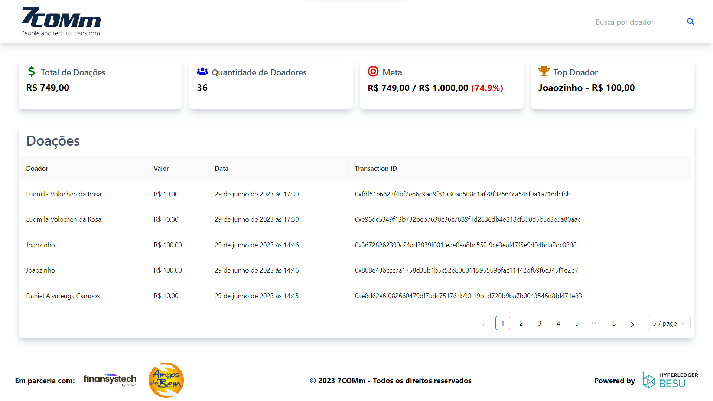

# Projeto Doações com Blockchain e Hyperledger Besu

Este projeto é uma solução de gerenciamento de doações que aproveita a natureza imutável e transparente da blockchain para garantir a integridade dos dados de doações. Ele possui um backend em Node.js e um frontend em React, utilizando a biblioteca TailwindCSS para estilização. O backend fornece uma API RESTful para receber dados de doações que são então armazenados em uma blockchain usando Hyperledger Besu e um contrato inteligente escrito em Solidity.

## Como funciona

Quando uma doação é feita, a empresa responsável envia os dados da doação para nossa API usando o método POST. Esses dados são então armazenados no contrato inteligente na blockchain. No frontend, temos uma tabela que busca os dados das doações diretamente da blockchain e as exibe de forma organizada. A tabela inclui o nome do doador, o valor da doação, a data e hora da doação, e o ID da transação para cada doação.

## Configuração do Projeto

Primeiro, instale as dependências do projeto usando npm:

\`\`\`bash
npm install
\`\`\`

Depois, certifique-se de que você tem um arquivo .env no diretório raiz do projeto com as seguintes variáveis de ambiente:

- `CLIENT_ID`: O ID do cliente para autenticação básica.
- `CLIENT_SECRET`: O segredo do cliente para autenticação básica.
- `PRIVATE_KEY`: A chave privada do endereço Ethereum que está realizando as transações.
- `BESU_RPC`: O endpoint RPC do nó Besu.
- `CONTRACT_ADDRESS`: O endereço do contrato inteligente das doações na blockchain.

Por fim, inicie o servidor Node.js:

\`\`\`bash
npm start
\`\`\`

O servidor estará ouvindo na porta 3000.

## Endpoints da API

- `POST /api/donations`: Adiciona uma nova doação à blockchain.
- `GET /api/donations`: Recupera todas as doações da blockchain.
- `GET /api/donations/count`: Recupera a quantidade de doações na blockchain.

Para mais detalhes sobre como usar esses endpoints, consulte a documentação completa da API.

## Compilação e Implantação do Contrato Inteligente

Para compilar e implantar o contrato inteligente, primeiro configure o Truffle:

\`\`\`bash
truffle compile
truffle migrate --reset --network development
\`\`\`

Lembre-se de que você precisa ter o Ganache em execução e configurado corretamente para usar a rede de desenvolvimento.

## Executando os Testes

Para executar os testes do contrato inteligente, use o seguinte comando:

\`\`\`bash
truffle test
\`\`\`

## Licença

Este projeto é licenciado sob a [Licença MIT](LICENSE).
